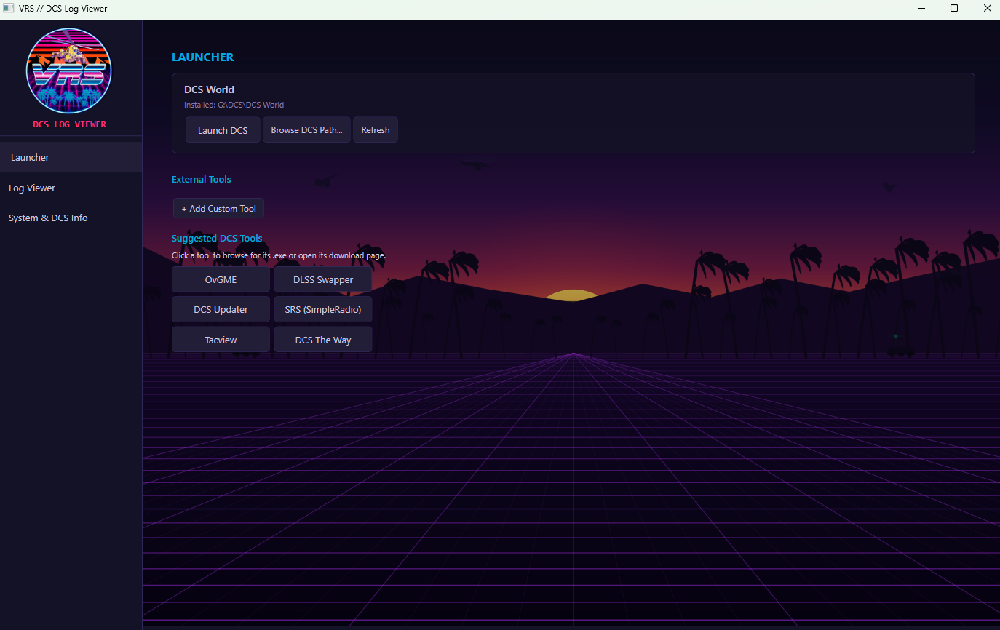

# VRS DCS Manager

A DCS World server management and log analysis tool built for the **VRS** community.

Standalone Windows desktop application with a synthwave-themed UI.

---

## Features

- **Log Viewer** - Parse DCS World log files with color-coded severity levels (Trace, Debug, Info, Warning, Error, Fatal). Multiple log profiles and real-time file watching.

- **Issue Detection** - Automatically scans logs for known DCS problems and displays actionable diagnostics.

- **DCS Launcher** - Detect your DCS installation, launch the game, and manage saved games paths.

- **External Tools Manager** - Add, launch, and manage third-party DCS utilities (DXVK, DLSS Swapper, DCS Updater, Tacview, SRS, LotATC, etc.) with one-click download links.

- **DXVK Integration** - Check DXVK status and manage installation.

- **Animated Background** - Synthwave/retrowave scene with perspective grid, neon sun, mountains, palm trees, military aircraft combat (jets, helicopters, tracers, missiles, dogfights), and SAM sites with spinning radar and missile launches.

---

## Screenshots



---

## Requirements

- Windows 10/11 (x64)
- No .NET runtime needed - ships as a self-contained single-file executable

---

## Building from Source

Requires [.NET 8 SDK](https://dotnet.microsoft.com/download/dotnet/8.0).

```bash
git clone https://github.com/Arcanum115/DCS-VRS-Log-Viewer.git
cd DCS-VRS-Log-Viewer
dotnet publish DCSLogViewer/DCSLogViewer.csproj -c Release -p:PublishProfile=Properties/PublishProfiles/SingleFileExe.pubxml
```

Or use the included `publish.bat` on Windows.

Output EXE: `DCSLogViewer/bin/Publish/DCSLogViewer.exe`

---

## Project Structure

```
DCSLogViewer.sln
DCSLogViewer/
|-- App.xaml / App.xaml.cs
|-- MainWindow.xaml / .cs
|-- Assets/
|   |-- VRS_Logo.png
|-- Controls/
|   |-- SynthwaveBackground.cs
|-- Converters/
|   |-- LogLevelConverters.cs
|-- Models/
|   |-- AppConfig.cs
|   |-- DcsLogProfile.cs
|   |-- DetectedIssue.cs
|   |-- ExternalTool.cs
|   |-- LogEntry.cs
|   |-- PerformancePreset.cs
|-- Services/
|   |-- DxvkManager.cs
|   |-- LogFileWatcher.cs
|   |-- LogIssueDetector.cs
|-- ViewModels/
|   |-- LauncherViewModel.cs
|   |-- LogTabViewModel.cs
|   |-- MainViewModel.cs
|   |-- PerformanceViewModel.cs
|-- Properties/
    |-- PublishProfiles/
        |-- SingleFileExe.pubxml
```

---

## Tech Stack

- **WPF** (.NET 8, C#)
- **CommunityToolkit.Mvvm** for MVVM pattern
- **Custom rendering** via DrawingContext / StreamGeometry for the animated background

---

## License

This project is licensed under the [MIT License](LICENSE). Free to use, modify, and distribute.
